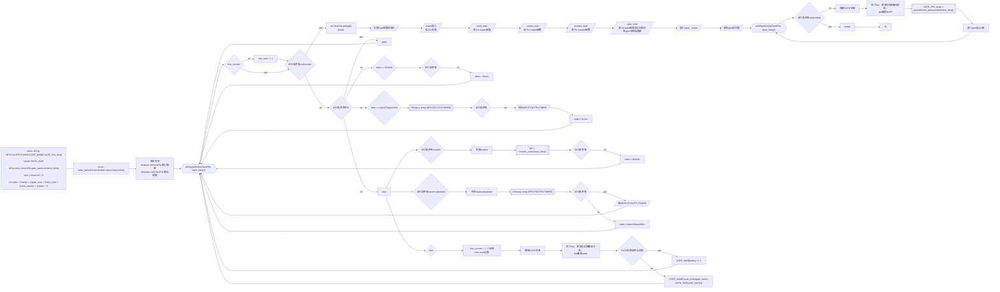

# CAD_for_VLSI_Design
## PA1：Benchmark Translator
### Goal：
Transfer a Verilog file (.v) of an ISCAS'85 circuit to a corresponding benchmark file (.bench).
This is useful in the IC design process, and the benchmark will be verified for correctness using CEC (Combinational Equivalence Checking).

### Ex： bench/c432.v
```bash
MN:c432
INPUT|36|:1 4 8 11 14 17 21 24 27 30 34 37 40 43 47 50 53 56 60 63 66 69 73 76 79 82 86 89 92 95 99 102 105 108 112 115
OUTPUT|7|:223 329 370 421 430 431 432
WIRE|153|:118 119 122 123 126 127 130 131 134 135 138 139 142 143 146 147 150 151 154 157 158 159 162 165 168 171 174 177 180 183 184 185 186 187 188 189 190 191 192 193 194 195 196 197 198 199 203 213 224 227 230 233 236 239 242 243 246 247 250 251 254 255 256 257 258 259 260 263 264 267 270 273 276 279 282 285 288 289 290 291 292 293 294 295 296 300 301 302 303 304 305 306 307 308 309 319 330 331 332 333 334 335 336 337 338 339 340 341 342 343 344 345 346 347 348 349 350 351 352 353 354 355 356 357 360 371 372 373 374 375 376 377 378 379 380 381 386 393 399 404 407 411 414 415 416 417 1 8 419 420 422 425 428 429
GATE:NOT|40| NAND|79| NOR|19| AND|4| XOR|18|
```



### PA2：Pipeline Scheduling
### Goal：
Write an automated scheduling tool. The tool aims to schedule all computation steps (i.e., nodes) within the specified CLK cycles (i.e., latency constraint) while minimizing the number of hardware units (Adders and Multipliers) required.

| Testcase | Latency constrain | Sample Adder num | Adder num | Sample Multiplier num | Multiplier num | 
| --- |--- |--- |--- |--- |
| Testcase1	  | 5	| 3	 | 3	| 1 | 1 |
| Testcase2	  | 19	| 12 | 7	| 19 | 10 |
| Testcase3	  | 43	| 813 | 120	| 1040 | 331 |

```mermaid
%% ---
%% title: main
%% ---

%% 不能有<>
%% [[]]:副函式
%% {{}}:迴圈
%% [//]:輸入輸出
%% {}:if

flowchart LR;
1["vector<struct node> NODE; // 儲存node資訊

    string input_temp; // 逐行讀檔暫存
    int Latency = 0; // 儲存Latency constrain

    vector<struct pipeline> PIPELINE; // 儲存CLK週期(數量由Latency constrain)
    vector<int> ready,waiting; // ready：放置已執行運算的node、waiting：待執行運算的node
"]-->

2["檔名宣告
ifstream inClientFile 輸入檔案
ofstream outClientFile 輸出檔案
"]-->

3["儲存Latency constrain"]-->

4["第一次讀檔 // 逐行讀取node"]-->

5{{"是否讀完檔案"}}-->

|no|5_1["node_split(NODE,input_temp,ready) // 分割與紀錄node的各項資訊"]-->5
5-->|yes|6["node_show(NODE) // 顯示所有node"]-->7

7["重新讀檔並跳到node位置"]-->

8["根據Latency constrain創立CLK週期數(PIPELINE)
並將各層Adder、Multiplier的數量歸零
"]-->

9{{"是否讀完檔案"}}-->

|no|9_1["waiting_arrangement(NODE,PIPELINE,ready,waiting) // 將未計算的node進行放置"]-->9_2["pipeline_arrangement(input_temp,NODE,PIPELINE,ready,waiting) // 安排node在CLK週期位置"]-->9
9-->|yes|10["waiting_arrangement(NODE,PIPELINE,ready,waiting) // 將未計算的node進行放置"]-->11

11["輪巡各CLK週期並紀錄Adder、Multiplier最大數量"]-->

12["輸出Adder、Multiplier最大數量"]-->

13["輸出各層CLK週期"]-->

14["關閉讀入檔案、輸出檔案"]
```


